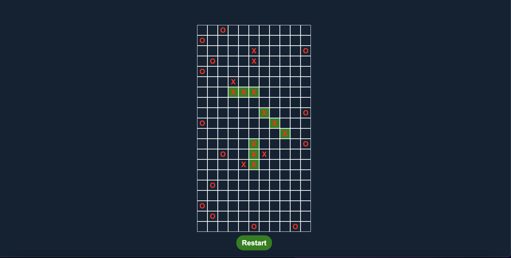

## patika react tic-tac-toe team project

### Introduction

Our tic tac toe team project that we developed using React

### Tools

* React
* UUID

### Deployment Link

https://vercel.com/yusufavcilar/react-tic-tac-toe-team-project

### Setup

* Clone project to your computer git clone `https://github.com/yusufavcilar/react-tic-tac-toe-team-project`
* Install dependencies `npm install`
* Starting local server `npm run start`
  

### Contact

* <a href="mailto:yusufavcilar53@gmail.com" target="_blank">Email </a>
* [Twitter](https://twitter.com/yusufavcilarr)
* [Linkedin](https://www.linkedin.com/in/yusuf-avcilar/)
* [Github](https://github.com/yusufavcilar)

### Repository

https://github.com/yusufavcilar/react-tic-tac-toe-team-project

### Licence

[MIT](LICENCE)

### Team Project 

Emir Al - Github Profile : https://github.com/themythia

Kadir Özsoy - Github Profile : https://github.com/kozsoy

Enes Yasin Gedik - Github Profile : https://github.com/Argedik
